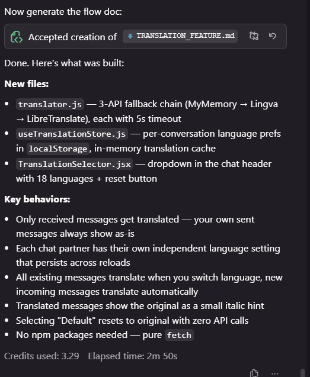
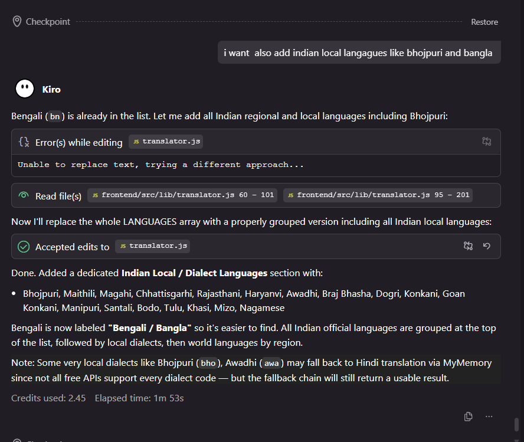
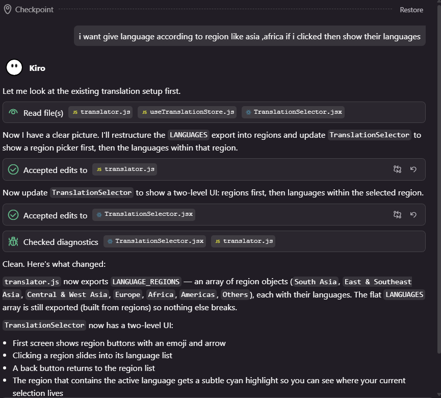

# ChatNova — Message Translation Feature

## Packages Installed
None — uses public REST APIs via native `fetch`. No npm install needed.

---

## New Files Created

| File | Purpose |
|------|---------|
| `frontend/src/lib/translator.js` | Translation API fallback chain + LANGUAGES list |
| `frontend/src/store/useTranslationStore.js` | Per-user language prefs (localStorage) + translation cache |
| `frontend/src/components/TranslationSelector.jsx` | Language dropdown in ChatHeader |

## Files Modified

| File | What Changed |
|------|-------------|
| `frontend/src/components/ChatHeader.jsx` | Added `<TranslationSelector>` |
| `frontend/src/components/ChatContainer.jsx` | Reads translation store, shows translated text |

---

## Translation APIs (Fallback Chain)

If API 1 fails → tries API 2 → tries API 3. If all fail, shows original text.

| Priority | API | Notes |
|----------|-----|-------|
| 1 | MyMemory `api.mymemory.translated.net` | Most reliable, no key needed |
| 2 | Lingva `lingva.ml` | Open source, no key needed |
| 3 | LibreTranslate `libretranslate.de` | May rate-limit, used as last resort |

Each API has a 5-second timeout before trying the next one.

---

## How It Works

### Language Selection
- Click the "Translate" button in the chat header
- Pick any language from the dropdown
- Each conversation has its own independent language setting
- Settings are saved in `localStorage` — persist across page reloads
- Click the ✕ badge or select "Default" to reset to original

### Translation Behavior
- Only **received messages** are translated (not your own sent messages)
- Sender always sees their own messages as-is
- When a language is selected, all existing messages in the chat are translated
- New incoming messages are also translated automatically
- Translated messages show the original text as a small italic hint below

### Caching
- Translations are cached in memory by `msgId + targetLang`
- Switching back to a previously translated language is instant (no re-fetch)
- Cache resets on page reload

### Default Mode
- "Default (No Translation)" = no API calls, zero overhead
- Original message text is shown exactly as the sender wrote it

---

## Flow Diagram

```
User opens chat
      ↓
Clicks "Translate" in header
      ↓
TranslationSelector opens
      ↓
┌─────────────────────────────────┐
│         REGION LIST             │
│  • Default (original)           │
│  • 🌏 South Asia          →     │
│  • 🌏 East & Southeast Asia →   │
│  • 🌍 Central & West Asia  →    │
│  • 🌍 Europe               →    │
│  • 🌍 Africa               →    │
│  • 🌎 Americas             →    │
│  • 🌐 Others               →    │
└─────────────────────────────────┘
      ↓ user clicks a region (e.g. Africa)
┌─────────────────────────────────┐
│  ← 🌍 Africa                    │
│  • Swahili                      │
│  • Amharic                      │
│  • Yoruba                       │
│  • Hausa                        │
│  • Zulu                         │
│  • ...                          │
└─────────────────────────────────┘
      ↓ user picks a language (e.g. Swahili)
useTranslationStore.setLang(userId, "sw")
      ↓
ChatContainer detects targetLang change
      ↓
translateMessages(messages, "sw") called
      ↓
For each message with text:
  Check cache → if hit, use cached
  If miss → try MyMemory API
    ↓ fail
  Try Lingva API
    ↓ fail
  Try LibreTranslate API
    ↓ fail
  Show original text
      ↓
Cache result → re-render with translated text
Original text shown as italic hint below
```

---

## Region → Language Mapping

| Region | Languages |
|--------|-----------|
| 🌏 South Asia | Hindi, Bengali, Telugu, Marathi, Tamil, Gujarati, Kannada, Malayalam, Punjabi, Odia, Urdu, Assamese, Nepali, Sinhala, Sindhi, Kashmiri, Bhojpuri, Maithili, Dogri, Konkani, Manipuri, Santali |
| 🌏 East & Southeast Asia | Chinese (Simplified/Traditional), Japanese, Korean, Vietnamese, Thai, Indonesian, Malay, Filipino, Burmese, Khmer, Lao, Mongolian |
| 🌍 Central & West Asia | Arabic, Persian, Turkish, Pashto, Kazakh, Uzbek, Turkmen, Kyrgyz, Tajik, Azerbaijani, Hebrew, Armenian, Georgian |
| 🌍 Europe | English, Spanish, French, Portuguese, Russian, German, Italian, Polish, Ukrainian, Dutch, Romanian, Hungarian, Greek, Czech, Swedish, Danish, Finnish, Norwegian, and more |
| 🌍 Africa | Swahili, Amharic, Yoruba, Igbo, Hausa, Zulu, Afrikaans, Somali, Kinyarwanda, Shona, Sesotho, Xhosa |
| 🌎 Americas | English, Spanish, Portuguese, French, Haitian Creole |
| 🌐 Others | Latin, Esperanto |

---

## UI State Machine

```
open=false
    ↓ click "Translate"
open=true, activeRegion=null   ← shows region list
    ↓ click a region
open=true, activeRegion="Africa"  ← shows language list for Africa
    ↓ click ← back
open=true, activeRegion=null   ← back to region list
    ↓ click a language
open=false, activeRegion=null  ← dropdown closes, lang saved
    ↓ click ✕ badge (or Default)
lang reset to "default"        ← translation disabled
```



